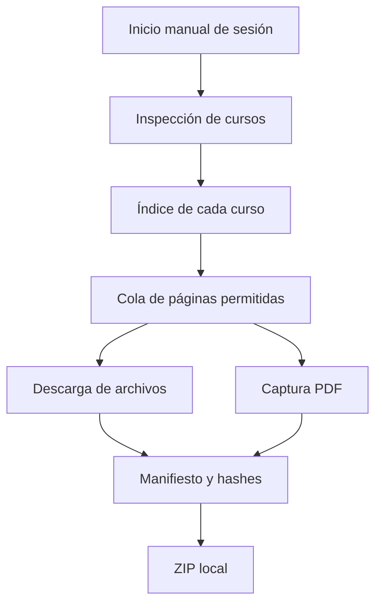

# Arquitectura

## Componentes

| Módulo | Responsabilidad |
| --- | --- |
| `main.py` | CLI, coordinación de fases, resumen y ZIP final. |
| `browser.py` | Perfil persistente y ciclo de vida de Playwright. |
| `config.py` | Valores predeterminados, carga y resolución de rutas. |
| `inspector.py` | Detección de cursos desde Ágora y el DOM. |
| `scraper.py` | Recorrido seguro de cursos y capturas PDF. |
| `downloader.py` | Descarga autenticada, hashes y manifiesto. |
| `utils.py` | Normalización de URL, nombres y escritura atómica. |

## Flujo

## Límites de seguridad

- Se restringe la navegación a dominios configurados y al identificador del curso actual.
- Se excluyen rutas de cierre de sesión, borrado, baja, administración y mensajería.
- Las variantes de idioma no se recorren para evitar duplicados y bucles.
- Las acciones de descarga se realizan mediante `GET`; no se envían formularios de actividades.
- La sesión permanece en `.browser-profile`, que nunca debe versionarse.
